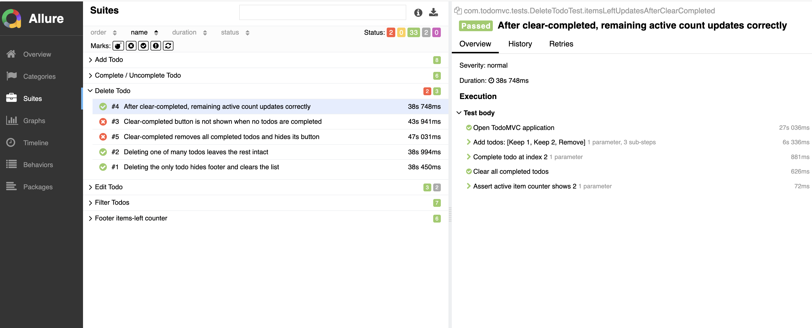

# TodoMVC Selenide + Allure Test Suite

Automated UI tests for [TodoMVC React](https://todomvc.com/examples/react/dist/)  
built with **Selenide 7**, **JUnit 5**, and **Allure 2**.

---

## Project Structure

```
todomvc-tests/
├── pom.xml
└── src/test/java/com/todomvc/
    ├── config/
    │   └── BrowserConfig.java         # Selenide + Allure listener setup
    ├── pages/
    │   └── TodoPage.java              # Page Object (all selectors + @Step actions)
    └── tests/
        ├── BaseTest.java              # @BeforeAll/@AfterAll wiring
        ├── AddTodoTest.java           # 6 tests – adding items
        ├── CompleteTodoTest.java      # 6 tests – complete / toggle-all
        ├── DeleteTodoTest.java        # 5 tests – delete + clear-completed
        ├── EditTodoTest.java          # 5 tests – inline editing
        ├── FilterTodoTest.java        # 7 tests – All / Active / Completed
        └── FooterCounterTest.java     # 6 tests – items-left counter + footer visibility
```

---

## Prerequisites

| Tool | Version |
|------|---------|
| Java | 17+ |
| Maven | 3.9+ |
| Chrome | latest stable |
| ChromeDriver | auto-managed by Selenide |

---

## Run Tests

```bash
# Headless (default – CI friendly)
mvn test

# Headed (visible browser)
mvn test -Dheadless=false

# Specific test class
mvn test -Dtest=AddTodoTest

# Custom URL
mvn test -Dapp.url=https://todomvc.com/examples/react/dist/
```

---
## Parallel Execution

Tests run in parallel at the **class level** — each test class gets its own thread and its own browser instance. Methods within a class run sequentially to avoid shared-state race conditions.

```bash
# Default — 4 parallel browser forks
mvn clean test

# Reduce forks on slower machines
mvn clean test -Dparallel.forks=2

# Single thread — useful for debugging flaky tests
mvn clean test -Dparallel.forks=1
```


## Generate Allure Report

```bash
# After mvn test completes:
mvn allure:serve       # opens report in browser automatically

# Or generate static files:
mvn allure:report      # → target/allure-report/index.html
```

---

## Test Coverage

### Covered Areas

| Feature | Tests | Priority |
|---------|-------|----------|
| Add todo | 6 | BLOCKER / CRITICAL |
| Complete / Uncomplete | 6 | BLOCKER / CRITICAL |
| Delete todo | 5 | BLOCKER / CRITICAL |
| Edit todo | 5 | CRITICAL / NORMAL |
| Filters (All/Active/Completed) | 7 | CRITICAL |
| Footer counter | 6 | CRITICAL |
| **Total** | **35** | |

### Coverage Rationale

**Why these scenarios first?**

1. **Add todo** – Core CRUD entry point. If creation is broken, nothing else works.
2. **Complete / Toggle-all** – State mutation that drives filter and counter logic.
3. **Delete** – Irreversible action; edge cases (last item, clear-completed) matter.
4. **Edit** – Inline editing with keyboard UX; ESC/Enter semantics, empty-save = delete.
5. **Filters** – URL-state driven; each filter compounds with completion state.
6. **Footer counter** – Derived state; correct counts confirm the data model is consistent.

**What was intentionally excluded** (out of scope for this task):
- Persistence after page reload (localStorage) — worthy test but needs network mocking
- Keyboard shortcuts beyond Enter/Escape
- Accessibility / ARIA attributes
- Visual regression / pixel comparison
- Performance / load testing

---

## Key Design Decisions

### Page Object Pattern
`TodoPage` owns every selector. Tests never reference CSS selectors directly,
so a DOM change only requires editing one file.

### Fluent API
Every action method returns `this`, enabling readable method chains:
```java
todoPage
    .addTodo("Buy milk")
    .completeTodo(0)
    .assertItemsLeftCount(0);
```

### Allure Integration
- `SelenideLogger.addListener("allure", new AllureSelenide())` captures every
  Selenide action automatically as an Allure step.
- `@Step` on Page Object methods adds business-readable labels.
- `@Epic / @Feature / @Story / @Severity` on test classes/methods build a full hierarchy in the report.
- Screenshots on failure are attached automatically.

### BaseTest
Registers the Allure listener once in `@BeforeAll`, opens a fresh page in
`@BeforeEach`, and closes the driver in `@AfterEach` — clean isolation without
the overhead of a full browser restart between suites.


## Known Application Bugs

Bugs discovered during test automation against https://todomvc.com/examples/react/dist/
Tests for these scenarios are present in the suite but marked `@Disabled` with a reference.

| ID      | Feature                | Expected (spec)                           | Actual                                           | Test                          |
|---------|------------------------|-------------------------------------------|--------------------------------------------------|-------------------------------|
| BUG-001 | Clear completed button | Hidden when no completed todos exist      | Always visible whenever any todos exist          | `DeleteTodoTest`              |
| BUG-002 | Escape during editing  | Exits edit mode and discards changes      | Field remains in edit mode, changes not reverted | `EditTodoTest`                |
| BUG-003 | Empty edit + Enter     | Deletes the todo                          | Stays in edit mode with blank field              | `EditTodoTest`                |

### Spec Reference
Official TodoMVC spec: https://github.com/tastejs/todomvc/blob/master/app-spec.md

> "Should be hidden when there are no completed todos" — Clear completed button
>
> "If escape is pressed during the edit, the edit state should be left and any changes be discarded" — Editing

### Decision
Tests are **not adjusted to match broken behavior**. Spec-correct assertions are preserved
and marked `@Disabled` with a bug description so the suite acts as a living spec document.
When the app is fixed, removing `@Disabled` is the only change needed to re-enable the test.